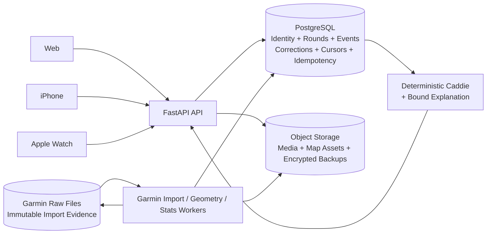

# Garmin AI Caddie 全仓库代码、架构、发布与文档审查

> **审查日期：** 2026-07-11 UTC
> **审查基线：** 本地 `integration/v2` @ `a0c0fca`
> **远端对照：** `origin/integration/v2` @ `b5e17d3`
> **分支关系：** 本地是远端祖先，落后 46 个提交（`46 0`）
> **审查性质：** 只读全仓库审查；包含静态分析、针对性并发复现、构建/测试、依赖审计和只读外部发布配置核验
> **结论：** 当前版本不适合继续扩大 TestFlight、家庭成员或公开试用

本报告取代旧的 [`docs/CODE_REVIEW_FINDINGS.md`](../CODE_REVIEW_FINDINGS.md) 作为当前权威代码审查记录。旧文件保留为历史资料，其中“无 blocker”等结论不再适用于当前代码和发布状态。

本报告完成后，又使用本机 Claude Code 以 `--model fable --effort max` 做了一轮禁读本报告的独立审查。Claude 原始输出见 [`2026-07-11-claude-fable-max-independent-review.md`](2026-07-11-claude-fable-max-independent-review.md)，Codex 对其新增意见的动态核验、范围修正和合并优先级见 [`2026-07-11-codex-claude-cross-review.md`](2026-07-11-codex-claude-cross-review.md)。下文 78 项计数是 Codex 原始轮次，不包含交叉审查确认的新增问题类别；发布决策应同时阅读交叉审查补充。

---

## 1. 管理层结论

这个项目不是一个低质量原型。它已经具备比较扎实的领域建模、Garmin 数据解析、球场几何、统计分析、离线记分和多端协同基础；测试数量、契约意识和 owner/member 隔离意识也明显高于一般个人项目。

但当前最核心的问题不是功能数量，而是以下基础不变量尚未建立：

1. **发布包不能携带全局管理员凭据。** 当前真实 IPA 已确认携带管理员令牌。
2. **一杆记录一旦写入，任何断网、并发、进程退出或设备切换都不能使其丢失。** 当前 iPhone、Watch 和后端均存在永久丢事件路径。
3. **结束球局必须意味着“保存并等待同步”，不能意味着删除。** 当前 iPhone 和 Watch 均存在结束时清空记录的路径。
4. **幂等、游标和修改序列必须由事务保证。** 当前多个文件型 read-modify-write 流程在并发下会重复或丢更新。
5. **健康、备份和发布门禁必须验证真实依赖。** 当前存在 health 200 但身份数据库不可用、备份可泄密且不可完整恢复、远端发布 SHA 无 CI 的假绿状态。

因此当前发布判断为：

- **暂停扩大 TestFlight 分发。** 已安装的内部设备可以用于受控排查，但不应继续增加测试者。
- **暂停把现有 snapshot 当作 secret-free 备份复制或上传。**
- **先修安全与记分可靠性，再继续投入 AI 表达和 Watch 视觉打磨。**

建议的产品优先顺序是：

```text
可靠记分 > 同步恢复 > 身份与权限 > 统计正确性 > AI 解释 > Watch 视觉打磨
```

本报告共登记 **78 个唯一问题**，同一根因的多端表现已尽量归并：

| 等级 | 数量 |
|---|---:|
| P0 | 8 |
| P1 | 27 |
| P2 | 33 |
| P3 | 10 |

---

## 2. 风险等级和证据标签

### 2.1 风险等级

| 等级 | 定义 | 发布含义 |
|---|---|---|
| **P0** | 已确认安全事故、不可逆数据丢失或核心主流程阻断 | 未处理前停止扩大分发 |
| **P1** | 高概率造成错误授权、错误数据、无法登录、跨端不一致或生产假绿 | 扩大试用前必须完成 |
| **P2** | 会造成局部错误、长期维护风险、性能问题或 App Store/可观测性风险 | 下一至两个迭代完成 |
| **P3** | 可用性、无障碍、测试质量、文档和工程效率问题 | 纳入持续改进 |

### 2.2 证据标签

| 标签 | 含义 |
|---|---|
| **外部实测** | 对 GitHub 配置、artifact 或发布状态执行了只读核验 |
| **本地实测** | 在临时目录、测试进程或审计工具中确定性复现 |
| **代码路径确认** | 从完整控制流和数据流可以直接得出结果，但未在真机/真实服务触发 |
| **远端仍存在** | 已与 `origin/integration/v2` 对照，远端没有修复 |
| **仅远端** | 当前本地 HEAD 尚不存在，但远端新代码引入了问题 |

本报告不会声称发现了“所有可能存在的 bug”。“完整问题目录”指本轮审查中所有已确认、可定位且值得处置的问题；同一根因在多个客户端上的表现会归并为一个登记项。

---

## 3. 审查范围与方法

### 3.1 覆盖范围

| 范围 | 主要内容 |
|---|---|
| Backend | `server_v2/`、`ai_caddie/`、身份、同步、统计、几何、AI、媒体、文件存储 |
| Web | `web_v2/src/`、Vite、Vitest、Playwright、Vercel、API 契约 |
| iPhone | SwiftUI 主流程、离线存储、同步、Apple/Garmin auth、媒体、GPS |
| Apple Watch | 独立记分、companion、WatchConnectivity、GPS、地图和上传 |
| Contracts | `mobile/contracts/`、Swift Codable、后端 Pydantic 和 TypeScript 类型 |
| Operations | GitHub Actions、Render、Fly、Docker、备份、readiness、依赖安全 |
| Documentation | README、用户指南、产品手册、部署/运维/安全文档、旧 review/spec/plan |

### 3.2 使用的方法

- 逐文件静态数据流和控制流审查。
- 当前 HEAD 与远端 `integration/v2` 的针对性 diff 对照。
- 临时目录并发复现：round ingest、correction、ACK、通用 atomic write。
- 临时 snapshot 复现：嵌套成员 `.garmin_tokens` 被打包。
- fresh SQLite 复现：静态 health 成功但身份查询失败。
- GitHub API 只读核验：仓库公开性、branch protection、security features、environments、workflow runs 和 artifacts。
- 单个 IPA 只检查 Info.plist 键的存在、是否展开和长度；没有读取或输出真实值。
- Python compile、Web lint/build、Vitest、mobile contracts、后端定向测试、`pip-audit`、`npm audit`。

### 3.3 未覆盖或无法完成的验证

- 当前 Linux 环境没有 Xcode、真实签名链和真机，因此无法执行 archive validation、App Store privacy validation 或真实 Watch workout 生命周期测试。
- 未连接真实 Garmin 账号执行写操作。
- 未实际部署 Render/Fly/Vercel，也未上传新的 TestFlight build。
- 未对真实移动 Safari 执行 80MB 视频压力测试。
- 后端全量测试在默认模式下读取了挂载的私有数据，运行约 58 分钟后主动中止；详见第 12 节。

---

## 4. 立即事故响应清单

以下操作应在继续代码迭代前完成。它们涉及外部服务和凭据，本次审查没有代为执行。

### 4.1 管理员令牌

- [ ] 记录受影响 workflow run、artifact 和 TestFlight build ID，保留必要的取证元数据。
- [ ] 轮换 `AI_CADDIE_ADMIN_TOKEN`。
- [ ] 删除受影响的 GitHub Actions IPA artifacts。
- [ ] 停止或撤销受影响 TestFlight build 的继续分发。
- [ ] 审计后端访问日志，重点检查非预期 IP、管理路由、player 管理和同步操作。
- [ ] 从 workflow、Fastlane、Xcode build settings 和 Info.plist 中删除 admin token 注入。
- [ ] 增加 Release archive 检查：发现 `AICaddieAdminToken` 非空时构建必须失败。

### 4.2 备份和 Garmin 会话

- [ ] 暂停对现有 snapshot 使用 `secretFree` 标签。
- [ ] 盘点曾复制、上传或离开可信存储边界的 snapshot。
- [ ] 如果 snapshot 曾外传，撤销对应成员的 Garmin Web 会话并重新绑定。
- [ ] 修复嵌套 `.garmin_tokens` 排除规则，并增加归档后 secret scan。
- [ ] 重新设计包含 SQLite/PostgreSQL、文件数据和 schema revision 的一致性备份。

### 4.3 发布暂停条件

- [ ] 在 P0-SEC-01、P0-SEC-02、P0-BKP-01、P0-IOS-01、P0-IOS-02、P0-IOS-03、P0-WAT-01 和 P0-BE-01 关闭前，不增加新的外部测试者。

---

## 5. P0 详细问题

### P0-SEC-01：全局 owner/admin token 被打进真实 IPA

**证据类型：** 外部实测、代码路径确认、远端仍存在

**涉及文件：**

- [`.github/workflows/ios-testflight.yml`](../../.github/workflows/ios-testflight.yml)，第 67–79 行
- [`fastlane/Fastfile`](../../fastlane/Fastfile)，第 81–88 行
- [`mobile/ios/AICaddie/Info.plist`](../../mobile/ios/AICaddie/Info.plist)，第 21–24 行
- [`server_v2/players_api.py`](../../server_v2/players_api.py)，第 122–124、154–174 行

**触发条件：** 执行带 `AI_CADDIE_ADMIN_TOKEN` secret 的 TestFlight workflow。

**已确认事实：**

- workflow 将 secret 作为环境变量传入 Fastlane，并上传构建后的 IPA artifact。
- Fastlane 将其拼入 Xcode build arguments。
- Info.plist 把 `$(AI_CADDIE_ADMIN_TOKEN)` 展开到 `AICaddieAdminToken`。
- 审查时仓库为 public；共有 38 个未过期 IPA artifacts，其中 32 个来自含注入逻辑的 workflow。
- 对一个真实 artifact 做无值输出检查，键存在、已展开、非空、长度为 64。检查过程没有打印或保存令牌内容。

**影响：** 任何取得 TestFlight 包或 artifact 的人都可离线提取全局管理员凭据，并以 owner/admin 身份读取或修改家庭成员数据、调用管理和同步接口。Release 代码是否主动读取该字段不影响泄漏成立。

**修复方向：**

1. Release 客户端只使用 Apple session bearer。
2. admin token 仅用于服务端运维和受控 CI smoke，不进入任何客户端产物。
3. Release build 增加二进制/Info.plist secret scan。
4. artifact 上传前解压验证所有敏感键为空或不存在。

**验收标准：**

- 新 IPA 的 phone/watch bundle 均不存在非空 admin token。
- 旧 token 无法访问任一受保护接口。
- 发布 workflow 对非空敏感 build setting 直接失败。
- 受影响 artifact/build 处置有可追踪记录。

---

### P0-SEC-02：长期玩家和管理员凭据驻留 URL

**证据类型：** 代码路径确认、远端仍存在

**涉及文件：**

- [`server_v2/players_api.py`](../../server_v2/players_api.py)，第 83–91、348–349、388–397、409–416 行
- [`web_v2/src/playerContext.ts`](../../web_v2/src/playerContext.ts)，第 23–31 行
- [`web_v2/src/adminTokenStore.ts`](../../web_v2/src/adminTokenStore.ts)，第 38–46、63–78 行
- [`web_v2/vercel.json`](../../web_v2/vercel.json)

**触发条件：** 打开 `/p/<token>`、`?key=<token>` 或 `?admin=<token>`。

**影响：** 长期 bearer 会进入浏览历史、浏览器同步历史、书签、截图、剪贴板、Vercel/代理日志和潜在 Referer。玩家 token 泄漏可读写对应玩家；admin token 泄漏可完整接管家庭数据。

后端设置的 `Referrer-Policy` 只保护后端响应，不能保护由 Vercel 返回且地址栏仍含 token 的 HTML 文档。

**修复方向：**

- URL 只携带一次性、短有效期兑换码。
- 首次加载后立即用 `history.replaceState` 清除 URL。
- 兑换成 `Secure + HttpOnly + SameSite` cookie session。
- 废除长期 `?admin=`；管理员恢复走明确的受控登录流程。
- Vercel HTML 增加 CSP、`Referrer-Policy: no-referrer`、nosniff 和 frame protection。

**验收标准：**

- 地址栏、浏览历史和 access log 中不出现长期 credential。
- 兑换码重复使用或过期后返回 401。
- 页面加载完成后 URL 不含任何 bearer。

---

### P0-BKP-01：默认 snapshot 泄露成员 Garmin cookie/CSRF，却声明 `secretFree=true`

**证据类型：** 本地实测、代码路径确认、远端仍存在

**涉及文件：**

- [`ops/export_snapshot.py`](../../ops/export_snapshot.py)，第 11–25、37–66、74–96 行
- [`ops/backup_data.sh`](../../ops/backup_data.sh)，第 9–37 行
- [`ai_caddie/connectors/garmin_cn.py`](../../ai_caddie/connectors/garmin_cn.py)，第 69–78 行
- [`docs/security/secrets.md`](../security/secrets.md)，第 41–63 行

**触发条件：** 对包含成员 Garmin 绑定的运行目录执行默认 export/backup。

**复现结果：** 临时构造以下文件后运行 export：

```text
data/players/p_member/.garmin_tokens/web_cookie.txt
data/players/p_member/.garmin_tokens/csrf.txt
```

两个文件均出现在 tar 中，且 manifest 仍返回 `secretFree: true`。

**影响：** 被当作安全、可复制或可上传的备份实际上包含可重放的 Garmin 登录会话。文档只说明根目录 `.garmin_tokens` 被排除，没有覆盖成员分区中的嵌套目录。

**修复方向：**

- 遍历时按任意路径组件排除 `.garmin_tokens`、`.env*`、cookie、csrf、private key 等敏感模式。
- 导出完成后扫描成员名和内容特征，发现 secret 即失败并删除临时 archive。
- `secretFree` 必须来自扫描结果，不能硬编码。
- 增加嵌套成员凭据回归测试。

**验收标准：**

- 临时构造的 owner/member credential 均不会进入 tar。
- 注入 JWT/cookie/private-key 测试内容时 export 非零退出。
- readiness 只接受通过内容扫描的 manifest。

---

### P0-IOS-01：上传期间新增事件可能被 sync marker 永久跳过

**证据类型：** 代码路径确认、确定性竞态分析、远端仍存在

**涉及文件：**

- [`mobile/ios/AICaddie/Services/OfflineStore.swift`](../../mobile/ios/AICaddie/Services/OfflineStore.swift)，第 272–311 行
- [`mobile/ios/AICaddie/AICaddieApp.swift`](../../mobile/ios/AICaddie/AICaddieApp.swift)，第 602–653 行

**触发序列：**

1. `loadPendingEvents()` 取得上传快照 A。
2. 网络请求进行中，用户又写入事件 B。
3. A 的响应成功后，客户端在日志尾部追加全局 sync marker。
4. B 位于这个 marker 之前。
5. 下一次 pending 只读取最后 marker 之后的事件，B 永久被视为已同步。

虽然后端回执提供 `acceptedEventIds` 和 `duplicateEventIds`，本地 outbox 并没有使用它们逐事件出队。

**影响：** 离线/弱网实战中，用户已经看到保存成功的成绩、推杆、罚杆或定位可能永远不到达后端。

**修复方向：**

- outbox 记录每个 `(clientId,eventId)` 的独立状态。
- 同一 round 同一时刻只允许一个 sync flight。
- 只清理本次快照中服务器明确 accepted/duplicate 的 event ID。
- sync marker 只可作为诊断记录，不能定义 pending 边界。

**验收标准：**

- 使用可控延迟 response，在请求期间追加事件，追加事件仍保持 pending 并在下一次上传。
- 进程在 response 前后被终止并恢复时，事件集合不减少。
- accepted/duplicate/partial response 均有竞争测试。

---

### P0-IOS-02：手机在 replay 前 ACK 全局序列，可永久漏掉 Watch/Web 事件

**证据类型：** 代码路径确认、确定性序列分析、远端仍存在

**涉及文件：**

- [`mobile/ios/AICaddie/AICaddieApp.swift`](../../mobile/ios/AICaddie/AICaddieApp.swift)，第 646–659 行
- [`mobile/ios/AICaddie/Services/SyncClient.swift`](../../mobile/ios/AICaddie/Services/SyncClient.swift)，第 318–357 行

**触发序列示例：**

1. Watch 写入事件，服务器 sequence = 1。
2. 手机随后 POST 自己的事件，服务器最新 sequence = 2。
3. POST response 返回 `serverSequence=2`。
4. 手机先 ACK 2，再以该客户端 ACK cursor 执行 replay。
5. sequence 1 不再返回，Watch 事件永久丢失于手机视图。

**根因：** “服务器已经接受手机 POST”被错误等价成“手机已经消费所有更早的跨客户端事件”。

**修复方向：** POST 成功只确认本次 event IDs；replay batch 完整落盘和投影成功后，才能 ACK `nextCursor`。

**验收标准：**

- phone/watch/web 交错写入 1…N 后，每个客户端最终消费完整 sequence。
- 崩溃发生在 fetch、落盘、投影、ACK 任一边界时都不会跳序列。
- ACK cursor 只能单调增加。

---

### P0-IOS-03：iPhone 主流程不能推进，且“结束本场”实际删除整场

**证据类型：** 代码路径确认、远端仍存在

**涉及文件：**

- [`mobile/ios/AICaddie/Views/CurrentHoleView.swift`](../../mobile/ios/AICaddie/Views/CurrentHoleView.swift)，第 699–718、1092–1119 行
- [`mobile/ios/AICaddie/Views/RoundHomeView.swift`](../../mobile/ios/AICaddie/Views/RoundHomeView.swift)，第 127–170、194–213 行
- [`mobile/ios/AICaddie/AICaddieApp.swift`](../../mobile/ios/AICaddie/AICaddieApp.swift)，第 588–600 行
- [`mobile/ios/AICaddie/Services/OfflineStore.swift`](../../mobile/ios/AICaddie/Services/OfflineStore.swift)，第 205–221 行

**问题 A：保存本洞不推进。** `submitEvents()` 只连续 emit 多个事件并推送 Watch state，不改变 active hole，也没有下一洞导航。首页又只能进入 active hole，因此用户无法按文档完成多洞球局。

**问题 B：结束本场等于 discard。** UI 文案是“结束本场”，确认后调用 `onDiscard()`，删除 active package、缓存和该 round 的全部事件，包括未同步记录。系统也没有持久化的 finished 状态。

**影响：** 一条路径阻断核心流程，另一条路径可删除整场球局。

**修复方向：**

- 将一次本洞保存改为原子 batch，并加入稳定 mutation ID。
- 保存成功后推进到 package 中的下一洞；末洞进入结束确认。
- 建立 `active`、`finished_pending_sync`、`finished_synced`、`discarded` 状态机。
- “保存并结束”和“放弃本场”必须是两个不同操作。

**验收标准：**

- UI test 强断言完成 1→2→…→18 洞。
- 末洞结束后杀进程、断网、重启，整场仍可恢复并继续上传。
- 只有显式选择“放弃并删除”才移除本地事件。

---

### P0-WAT-01：Watch 结束球局会清空未同步数据，并误判上传成功

**证据类型：** 代码路径确认、远端仍存在

**涉及文件：**

- [`mobile/ios/AICaddieWatch/Models/WatchRoundModel.swift`](../../mobile/ios/AICaddieWatch/Models/WatchRoundModel.swift)，第 254–297 行
- [`mobile/ios/AICaddieWatch/Services/WatchBackendClient.swift`](../../mobile/ios/AICaddieWatch/Services/WatchBackendClient.swift)，第 106–122 行
- [`mobile/ios/AICaddieWatch/Views/WatchFinishRoundView.swift`](../../mobile/ios/AICaddieWatch/Views/WatchFinishRoundView.swift)，第 61–74 行

**触发条件：**

- 无 backend 配置但 pending 非空；或
- backend 返回任意 2xx、部分 accepted、缺 event IDs、甚至异常但可宽松解析的 body。

**影响：** `finishLocally()` 清空 store；客户端忽略逐事件回执，将所有 pending 视为成功，导致不可恢复的数据丢失。现有部分测试还把这一行为固化为期望。

**修复方向：**

- 结束后保留 round 和 pending outbox。
- 严格解码 response schema；malformed 2xx 视为失败。
- 只删除明确确认的 event IDs，partial response 保留剩余集合。
- 上传期间禁用重复结束按钮，并显示错误与待上传数量。

**验收标准：**

- 无配置、离线、500、malformed 2xx、partial accepted、杀进程均不丢数据。
- 重新联网后可以从“已结束待同步”自动恢复上传。

---

### P0-BE-01：文件型核心写入没有事务，幂等和授权状态可并发损坏

**证据类型：** 本地实测、代码路径确认、远端仍存在

**涉及文件：**

- [`ai_caddie/rounds/round_ingest.py`](../../ai_caddie/rounds/round_ingest.py)，第 78–104、538–572、587–660 行
- [`ai_caddie/rounds/round_corrections.py`](../../ai_caddie/rounds/round_corrections.py)，第 107–125 行
- [`ai_caddie/core/data.py`](../../ai_caddie/core/data.py)，第 66–77 行
- [`ai_caddie/rounds/players.py`](../../ai_caddie/rounds/players.py)，第 73–132 行
- [`ai_caddie/caddie/mobile_live.py`](../../ai_caddie/caddie/mobile_live.py)，第 2273–2303、2588–2608 行

**已复现结果：**

- 两个并发 round ingest 都成功生成文件，但 idempotency index 只保留一个键；重试丢失的键会生成第三份球局。
- 相同 correction mutation 并发可写入两条相同 `clientMutationId` 和相同 `seq`。
- 同进程两个 `atomic_write_json` 使用相同 PID 临时文件名，稳定产生一个 `FileNotFoundError`。
- phone/watch 并发 ACK 后，最终 ACK 文件可能只剩一个客户端；较低序列也可覆盖较高序列。

**影响：** 重复球局、孤儿 scorecard/shots、summary/index 不一致、重复订正、游标倒退、玩家 registry/token 轮换丢更新。对身份和记分系统而言，这是数据完整性问题，不是普通性能优化。

**修复方向：**

1. 将 round mutation、correction、idempotency、ACK cursor、player registry 迁入 PostgreSQL 事务。
2. 迁移完成前按 player/round 使用跨进程锁。
3. idempotency key 必须绑定请求摘要；同 key 不同 payload 返回 409。
4. 文件临时名使用安全 tempfile/UUID，并 `fsync` 文件和目录。
5. ACK 使用 `max(old,new)`，不允许倒退。

**验收标准：**

- 多进程并发 100 次后，round、index、summary、shots 数量和 mutation 关系完全一致。
- 同一幂等键相同 payload 只产生一次副作用；不同 payload 明确 409。
- 所有客户端 ACK 均保留且单调。

---

## 6. P1 详细问题

### P1-DEP-01：Render 跳过 Alembic 和持久存储，health 产生假绿

**证据类型：** 本地实测、代码路径确认、远端仍存在

**涉及文件：**

- [`render.yaml`](../../render.yaml)，第 6–21 行
- [`ops/start_api.sh`](../../ops/start_api.sh)，第 4–15、42–46 行
- [`server_v2/main.py`](../../server_v2/main.py)，第 155–163、441–447 行
- [`server_v2/db.py`](../../server_v2/db.py)，第 35–39 行

Render 直接执行 Uvicorn，而正式入口才会运行 `alembic upgrade head` 和绑定私有持久目录。`/api/v2/health` 不访问数据库，因此 fresh SQLite 上会返回 200，但首次身份查询报 `no such table`。manifest 也没有托管 PostgreSQL、持久磁盘或 `AI_CADDIE_PRIVATE_ROOT`。

**影响：** 服务平台显示 healthy，Apple auth/session/family 接口却返回 500；实例替换还会丢失 SQLite、Garmin 数据和会话文件。

**验收标准：** 部署必须先迁移成功；readiness 校验 Alembic revision 和关键身份查询；实例替换后数据仍存在。

---

### P1-DEP-02：文档化的 Fly/Render 流程不能启动 Release Apple 登录

**证据类型：** 代码路径确认、远端仍存在

**涉及文件：**

- [`mobile/ios/AICaddie/AICaddieApp.swift`](../../mobile/ios/AICaddie/AICaddieApp.swift)，第 15–24 行
- [`server_v2/auth_api.py`](../../server_v2/auth_api.py)，第 38–42、119–145 行
- [`server_v2/identity_seed.py`](../../server_v2/identity_seed.py)，第 1–6、70–73 行
- [`.github/workflows/backend-fly-deploy.yml`](../../.github/workflows/backend-fly-deploy.yml)，第 146–159 行
- [`docs/deployment/private-trial.md`](../deployment/private-trial.md)，第 19–28 行

Release app 无 session 时强制 Apple 登录；但缺 `AI_CADDIE_APPLE_BUNDLE_ID` 会返回 503，未 seed owner 则返回 `owner user not provisioned`。部署 workflow 和文档没有把这两项列为强制条件。

**验收标准：** fresh 环境从 migration、identity seed、Apple exchange、refresh、owner mapping 到 authenticated smoke 全链路自动通过。

---

### P1-CI-01：合并后无 CI，仓库没有保护门禁

**证据类型：** 外部实测、代码路径确认、远端仍存在

**涉及文件：**

- [`.github/workflows/ci.yml`](../../.github/workflows/ci.yml)，第 3–6 行
- [`.github/workflows/native-mobile.yml`](../../.github/workflows/native-mobile.yml)，第 3–10 行

GitHub API 审查时点显示：

- `main`、`integration/v2` 均无 branch protection。
- 核心 CI 只在 pull request/manual 运行，没有默认分支 push trigger。
- 当前远端 merge SHA `b5e17d3` 没有 Actions run。
- secret scanning、push protection、Dependabot security updates 均关闭。
- 没有 GitHub Environments 或审批 gate。

**影响：** 直接 push、merge 结果或发布 SHA 可以完全未测试；不能证明默认分支是绿色的。

**验收标准：** 默认分支 required checks、禁止直接 push、至少一人 review、push CI、security features 和 release SHA 绿灯验证全部启用。

---

### P1-CI-02：Phase 6 readiness 只是可选审计，不阻断发布

**证据类型：** 代码路径确认、远端仍存在

**涉及文件：**

- [`.github/workflows/ios-testflight.yml`](../../.github/workflows/ios-testflight.yml)，第 7–18、58–79 行
- [`.github/workflows/phase6-readiness.yml`](../../.github/workflows/phase6-readiness.yml)，第 53–57、137–140 行
- [`.github/workflows/backend-fly-deploy.yml`](../../.github/workflows/backend-fly-deploy.yml)，第 208–219 行

TestFlight 可从任意 ref 直接上传，没有 `needs`、成功 CI 校验、ref guard 或 environment approval。readiness 的 incomplete 默认不失败，Fly 又固定使用 `--no-fail`。

**验收标准：** readiness 成为发布强制前置；只允许受保护 tag/SHA；任一安全、后端、Apple、安装或测试门禁不满足时发布 job 不启动。

---

### P1-CI-03：secret-bearing workflow 使用可变 Action 标签

**证据类型：** 代码路径确认、远端仍存在

包括 `superfly/flyctl-actions/setup-flyctl@master`、`ruby/setup-ruby@v1`、`actions/*@v4`、`astral-sh/setup-uv@v5`。Fly job 持有 `FLY_API_TOKEN` 和 admin token，签名流程持有 ASC/match 私钥。

**影响：** tag 移动或上游供应链失陷可在高权限上下文执行任意代码。

**验收标准：** 全部 Actions 固定到审核过的完整 commit SHA，并由 Dependabot/Renovate 通过 PR 更新。

---

### P1-BKP-02：现有备份无法完整恢复多用户系统

**证据类型：** 代码路径确认、远端仍存在

**涉及文件：**

- [`ops/export_snapshot.py`](../../ops/export_snapshot.py)，第 11–25 行
- [`server_v2/db.py`](../../server_v2/db.py)，第 35–39 行
- [`server_v2/identity_models.py`](../../server_v2/identity_models.py)，第 24–105 行
- [`docker-compose.yml`](../../docker-compose.yml)，第 28、42–50 行

snapshot 遗漏 `data/identity.db`，PostgreSQL 部署没有 `pg_dump`；同时遗漏 manual rounds、course reference 和部分 club bag 状态。恢复后可能失去 family owner、Apple subject、legacy mapping、session/revocation、device、ACL 和 access audit。

**验收标准：** SQLite/PostgreSQL 与文件快照具有一致时间点、schema revision 和统一 manifest；在全新环境完成 Apple 登录、成员授权、历史统计和手工球局恢复演练。

---

### P1-BE-02：Garmin 明细失败被吞掉，连接器仍发布 `ready`

**证据类型：** 代码路径确认、远端仍存在

**涉及文件：**

- [`ai_caddie/garmin/fetch.py`](../../ai_caddie/garmin/fetch.py)，第 261–264、307–309 行
- [`ai_caddie/connectors/garmin_cn.py`](../../ai_caddie/connectors/garmin_cn.py)，第 235–241、327–375 行
- [`tests/test_garmin_cn_connector.py`](../../tests/test_garmin_cn_connector.py)，第 249–272 行

summary 成功而 detail/shot 网络、5xx 或解析失败时，异常只打印并继续。连接器随后根据磁盘上的旧文件数量生成 snapshot；只要旧 scorecard 存在就可能返回 `ready`。现有测试还固定了“没有新内容但旧文件存在仍 ready”的行为。

**验收标准：** fetch 返回 attempted/succeeded/failed/unchanged；部分失败发布 `partial`，全部失败禁止切换 durable snapshot；UI 明确显示失败数量和最新成功更新时间。

---

### P1-BE-03：completed 球局和 `_no_data` shots 永久不刷新

**证据类型：** 代码路径确认、远端仍存在

**涉及文件：** [`ai_caddie/garmin/fetch.py`](../../ai_caddie/garmin/fetch.py)，第 218–221、265–273、290–295 行

本地球局一旦被判定 completed 就永久跳过 detail；shot 文件只要存在就永久跳过；一次 400 会写入 `_no_data`，后续永不重试。

**影响：** Garmin 延迟生成击球、用户赛后改分或一次瞬时 400 都可能使成绩、球杆和轨迹永久陈旧。

**验收标准：** 根据远端更新时间或版本刷新；每次固定重抓最近 N 场；负缓存带 TTL/退避；force refresh 绕过缓存。

---

### P1-BE-04：成员 stats cache 没有包含成员辅助证据

**证据类型：** 本地实测、代码路径确认、远端仍存在

**涉及文件：**

- [`ai_caddie/history/stats_cache.py`](../../ai_caddie/history/stats_cache.py)，第 81–93、141–146、182–229 行
- [`ai_caddie/core/data.py`](../../ai_caddie/core/data.py)，第 33–41 行

成员新增 annotation、weather snapshot、report 或 decision audit，而球局文件未变时，cache fingerprint 仍检查 owner 根路径。临时实测修改成员 annotation 后再次调用，build 次数仍为 1，直接命中旧缓存。

**影响：** 成员历史统计、画像、prep tips 和 caddie context 可无限期返回旧结果。

**验收标准：** `_aux_files` 按 `player_id` 使用 `evidence_root`；四类辅助证据各有成员 cache invalidation 测试。

---

### P1-AI-01：中文 AI 叙述可绕过 fact binding

**证据类型：** 本地实测、代码路径确认、远端仍存在

**涉及文件：**

- [`ai_caddie/reports/reports.py`](../../ai_caddie/reports/reports.py)，第 157–201、2281–2342、2601–2622 行
- [`ai_caddie/caddie/decision.py`](../../ai_caddie/caddie/decision.py)，第 411–472 行

报告提示要求中文，但审计关键词和事实 token 主要覆盖英文。decision explanation 只检查天气、比分和账号，没有检查提示中声称限制的球杆、lie、球位和障碍。

临时实测仅提供总场数事实，让模型叙述“逆风、每洞使用某球杆、粗草导致失误”，结果仍是 `bound` 且 unsupported count 为 0。即使检测为 `needs_review`，当前代码也仍原样返回叙述。

**影响：** 虚构的球杆、风、障碍或因果关系可能以“有事实约束”的形式展示和持久化。

**修复方向：**

- LLM 输出结构化 claims，每条必须引用允许的 fact ID。
- 未绑定 claim 使整个叙述 fail closed，改用 deterministic narrative。
- 支持中英文和数值/实体级验证，而不是关键词黑名单。
- 确定性推荐字段始终是唯一权威数据，LLM 只负责措辞。

**验收标准：** 任意没有 fact ID 的 club/weather/lie/hazard/scoring claim 都无法进入用户可见叙述。

---

### P1-WEB-01：Vercel consumer 构建没有可用的 Apple 登录入口

**证据类型：** 代码路径确认、远端仍存在

**涉及文件：**

- [`web_v2/vercel.json`](../../web_v2/vercel.json)，第 7–10 行
- [`web_v2/src/playerContext.ts`](../../web_v2/src/playerContext.ts)，第 45–46 行
- [`web_v2/src/App.tsx`](../../web_v2/src/App.tsx)，第 1546–1550 行
- [`docs/deployment/private-trial.md`](../deployment/private-trial.md)，第 30–38 行

manifest 只设置 API base，没有启用 `VITE_AI_CADDIE_REQUIRE_LINK`，也没有 Apple client ID/redirect。默认部署会进入无凭证 owner 壳并收到 401，但登录页不可达。

**验收标准：** consumer/owner 使用不同部署 manifest；consumer production build 固定启用 Apple gate，并有真实 build smoke 验证登录按钮参数。

---

### P1-WEB-02：成员 Garmin self-bind 前后端契约断开

**证据类型：** 代码路径确认、远端仍存在

**涉及文件：**

- [`web_v2/src/components/SyncStatusPanel.tsx`](../../web_v2/src/components/SyncStatusPanel.tsx)，第 85–100 行
- [`web_v2/src/App.tsx`](../../web_v2/src/App.tsx)，第 750–779、875–900 行
- [`web_v2/src/api.ts`](../../web_v2/src/api.ts)，第 598–617 行
- [`server_v2/main.py`](../../server_v2/main.py)，第 1252–1262、1338–1378 行

成员 `/sync/status` 返回 minimal status，面板因此提前隐藏连接表单。即使显示，Web 仍调用 owner-only `/sync/garmin[/session]`，没有调用已经存在的 `/players/{id}/sync/garmin[/session]`。

**验收标准：** 成员用自己的 Apple session 完成 WebView capture、bind、sync、过期重绑；任何步骤都不会读取 owner Garmin 状态。

---

### P1-WEB-03：切换球员可把 A 的球包保存给 B

**证据类型：** 代码路径确认、远端仍存在

**涉及文件：** [`web_v2/src/components/ClubBagPage.tsx`](../../web_v2/src/components/ClubBagPage.tsx)，第 42–85、106–180 行

load request 没有 sequence/AbortController，页面状态也没有绑定 loaded player ID。A 的慢响应可在已经切到 B 后覆盖 UI，而保存始终使用当前 `playerId=B`。

**验收标准：** state 保存 `{loadedPlayerId,data}`；保存要求 loaded/current ID 一致；切换时 abort；deferred promise 回归测试覆盖 A 后返回场景。

---

### P1-WEB-04：Web 退出不撤销服务器 session

**证据类型：** 代码路径确认、远端仍存在

**涉及文件：**

- [`web_v2/src/App.tsx`](../../web_v2/src/App.tsx)，第 245–258、546–552 行
- [`web_v2/src/sessionStore.ts`](../../web_v2/src/sessionStore.ts)，第 24–49、76–82 行
- [`server_v2/auth_api.py`](../../server_v2/auth_api.py)，第 57–68、182–206 行

sign-out 只删除 localStorage 和 reload，没有调用现有 logout/revoke。已复制的 30 天 bearer 在用户退出后仍然有效；客户端对 server-side revocation 或 Apple session 401 也没有统一恢复。

**验收标准：** logout best-effort revoke 后在 `finally` 清本地；旧 token 立即 401；401 使用单飞 refresh，失败则回登录页。

---

### P1-WEB-05：Web 记分整场只存在 React 内存

**证据类型：** 代码路径确认、远端仍存在

**涉及文件：**

- [`web_v2/src/components/RecordRoundPage.tsx`](../../web_v2/src/components/RecordRoundPage.tsx)，第 89–107、140–162、225–303 行
- [`web_v2/src/components/AppSidebar.tsx`](../../web_v2/src/components/AppSidebar.tsx)，第 103–147 行

没有 IndexedDB/localStorage draft、导航拦截或 unload guard，只在整场结束时一次性提交。刷新、导航、Safari tab 回收或崩溃会删除数小时记录。

**验收标准：** 每次洞/杆更新增量持久化；重新打开显示恢复提示；identity 未确定时禁止开局；导航前明确提示未提交草稿。

---

### P1-WEB-06：LiveSandbox 输入变化不会使旧建议失效

**证据类型：** 代码路径确认、远端仍存在

**涉及文件：** [`web_v2/src/components/LiveSandbox.tsx`](../../web_v2/src/components/LiveSandbox.tsx)，第 336–345、413–568 行

距离、球位、击球类型和风速改变时既不递增 request sequence，也不取消在途请求。界面可能在新输入旁展示旧输入生成的建议。

**验收标准：** 请求携带 input fingerprint；任一相关输入变化立即 abort/invalidate；response 落地前再次比较 fingerprint。

---

### P1-MOB-01：Watch 完整 round model 未接入手机 companion state

**证据类型：** 代码路径确认、远端仍存在

**涉及文件：**

- [`mobile/ios/AICaddieWatch/AICaddieWatchApp.swift`](../../mobile/ios/AICaddieWatch/AICaddieWatchApp.swift)，第 43–95 行
- [`mobile/ios/AICaddieWatch/Models/WatchRoundModel.swift`](../../mobile/ios/AICaddieWatch/Models/WatchRoundModel.swift)，第 140–166 行

手机状态进入 legacy 单洞视图，而地图、F/M/B、自有 GPS 和完整多洞流程读取另一套 `roundModel`；生产代码没有用手机全洞状态 seed/upsert 该模型。

**验收标准：** 单一 Watch round coordinator 接收手机全洞 revision snapshot，同时保留 Watch 本地 dirty events。

---

### P1-MOB-02：WatchConnectivity 快照会堆积、乱序和回滚

**证据类型：** 代码路径确认、远端仍存在

**涉及文件：**

- [`mobile/ios/AICaddie/Views/CurrentHoleView.swift`](../../mobile/ios/AICaddie/Views/CurrentHoleView.swift)，第 164–179 行
- [`mobile/ios/AICaddie/Services/WatchEventBridge.swift`](../../mobile/ios/AICaddie/Services/WatchEventBridge.swift)，第 432–445 行

位置约每移动 3 米发送完整状态；不可达时使用 durable FIFO `transferUserInfo`，但状态没有 revision/updatedAt。重连后旧洞、旧分数或旧建议可覆盖新状态。

**验收标准：** 状态快照使用 latest-wins `updateApplicationContext`；事件才使用 durable queue；接收方拒绝低 revision；位置发送有时间和距离双重节流。

---

### P1-MOB-03：Watch quick input 不是 write-ahead，队列也未串行

**证据类型：** 代码路径确认、远端仍存在

**涉及文件：** [`mobile/ios/AICaddieWatch/Services/WatchSyncClient.swift`](../../mobile/ios/AICaddieWatch/Services/WatchSyncClient.swift)，第 172–188、225–302、326–400 行

reachable 时先 sendMessage、后持久化；进程在 reply 前终止会丢事件。多个 WCSession callback 可并发 load-filter-write，造成丢更新、复活已 ACK 事件或重复 flush。

**验收标准：** actor/串行队列；先落盘再发送；ACK 后原子删除；同一时间只有一个 batch flush。

---

### P1-MOB-04：手机远端 replay 和投影顺序不可靠

**证据类型：** 代码路径确认、远端仍存在

**涉及文件：** [`mobile/ios/AICaddie/AICaddieApp.swift`](../../mobile/ios/AICaddie/AICaddieApp.swift)，第 620–706 行

- 本地 pending=0 时 foreground guard 直接返回，因此不会拉 Watch/Web 的新事件。
- replay 事件追加到本地 JSONL 后按本地 append 顺序 fold，没有保存 server sequence；较早远端事件后追加时可能覆盖服务器上较新的手机事件。

**验收标准：** foreground 只要存在 active round 就触发 debounced replay；本地投影按 server sequence，或直接消费权威 `/state`。

---

### P1-MOB-05：iPhone 保存本洞不是原子事务，可重复提交

**证据类型：** 代码路径确认、远端仍存在

**涉及文件：**

- [`mobile/ios/AICaddie/Views/CurrentHoleView.swift`](../../mobile/ios/AICaddie/Views/CurrentHoleView.swift)，第 1092–1118、1180–1189 行
- [`mobile/ios/AICaddie/AICaddieApp.swift`](../../mobile/ios/AICaddie/AICaddieApp.swift)，第 602–613 行

一次点击依次写 4–6 个独立 UUID 事件，每个事件单独触发同步。中途失败会产生半保存洞；快速双击可产生重复事件。

**验收标准：** 一次 UI save 对应一个稳定 mutation ID 和一个原子 batch；按钮有 saving/dirty guard；只触发一次同步。

---

### P1-MOB-06：复盘修改没有持久化 outbox，异步操作可乱序

**证据类型：** 代码路径确认、远端仍存在

**涉及文件：** [`mobile/ios/AICaddie/Models/RoundEditModel.swift`](../../mobile/ios/AICaddie/Models/RoundEditModel.swift)，第 27–57、119–143 行

网络失败只保留内存 optimistic map，杀进程即丢；快速 move/edit 可反序，add 后 refetch 还可能覆盖后续本地修改。

**验收标准：** correction outbox 持久化；按 round/hole 串行；使用 revision/sequence；refetch 后重放 pending operations。

---

### P1-MOB-07：Caddie 旧响应可覆盖最新策略或输入

**证据类型：** 代码路径确认、远端仍存在

**涉及文件：** [`mobile/ios/AICaddie/Views/CurrentHoleView.swift`](../../mobile/ios/AICaddie/Views/CurrentHoleView.swift)，第 192–195、923–959 行

策略变化会创建没有取消和 generation guard 的 Task。较慢的旧 stock response 可在用户切到 attack 后覆盖决策、球杆并同步给 Watch。

**验收标准：** request fingerprint 包含 round/hole/strategy/lie/distance/weather；取消旧 Task；落地前校验 generation。

---

### P1-MOB-08：Apple refresh、后端配置和退出链路不完整

**证据类型：** 代码路径确认、远端仍存在

**涉及文件：**

- [`mobile/ios/AICaddie/Services/AppleAuthClient.swift`](../../mobile/ios/AICaddie/Services/AppleAuthClient.swift)，第 44–65 行
- [`mobile/ios/AICaddie/Views/SignInView.swift`](../../mobile/ios/AICaddie/Views/SignInView.swift)，第 77–90 行
- [`mobile/ios/AICaddie/Views/BackendSettingsView.swift`](../../mobile/ios/AICaddie/Views/BackendSettingsView.swift)

refresh 路径错误，且没有生产 refresh/401 恢复流程；Release 缺 API URL 时先被登录 gate 卡住，而 BackendSettingsView 没有可达入口；Apple/Garmin sign-out 和 credential revoked 处理也不完整。

**验收标准：** 正确 refresh endpoint；过期前刷新；401 单飞刷新后重试；失败明确退出；Release archive 强制 API URL 或登录页提供安全恢复入口。

---

### P1-MOB-09：GPS 质量与 Watch 整场后台生命周期不足

**证据类型：** 代码路径确认、需要真机最终验证、远端仍存在

**涉及文件：**

- [`mobile/ios/AICaddie/Services/LocationProvider.swift`](../../mobile/ios/AICaddie/Services/LocationProvider.swift)，第 80–89 行
- [`mobile/ios/AICaddieWatch/Services/WatchLocationProvider.swift`](../../mobile/ios/AICaddieWatch/Services/WatchLocationProvider.swift)，第 19–89 行

过期、无效 accuracy 和低精度位置均可能显示为实时。Watch 没有完整 workout/extended-runtime 生命周期，锁屏和长时间球局的定位持续性、耗电和合规性未闭环。

**验收标准：** 过滤 age/accuracy/coordinate；低质量时回退静态距离；真机验证锁屏、后台、18 洞续航和 workout 结束清理。

---

### P1-MOB-10：媒体上传存在内存峰值和重复创建风险

**证据类型：** 代码路径确认、远端仍存在

**涉及文件：**

- [`mobile/ios/AICaddie/Views/MediaCaptureView.swift`](../../mobile/ios/AICaddie/Views/MediaCaptureView.swift)，第 97–173 行
- [`mobile/ios/AICaddie/Services/MediaUploadClient.swift`](../../mobile/ios/AICaddie/Services/MediaUploadClient.swift)，第 165–190 行
- [`web_v2/src/components/CaddiePage.tsx`](../../web_v2/src/components/CaddiePage.tsx)，第 1519–1587、1740–1746 行

最多 80MB 视频会整体加载，再产生 base64、JSON、URLSession/fetch body 等多份副本；移动 Safari/iOS 有明显崩溃风险。上传也缺稳定 media mutation ID，模糊失败重试可能重复创建。

**验收标准：** 流式 multipart/background upload、前端大小/MIME 检查、转码限制、上传状态锁、稳定幂等 ID。

---

### P1-MOB-11：Watch 坡度单位错误，米值被直接加到码数

**证据类型：** 代码路径确认、远端仍存在

**涉及文件：**

- [`mobile/ios/AICaddieWatch/Views/WatchRoundContainerView.swift`](../../mobile/ios/AICaddieWatch/Views/WatchRoundContainerView.swift)，第 163–171 行
- [`mobile/ios/AICaddieWatch/Views/WatchHoleMapView.swift`](../../mobile/ios/AICaddieWatch/Views/WatchHoleMapView.swift)，第 24–25、202–208 行

`elevationDeltaM` 以米为单位，却直接 rounded 后作为 `playsLikeDelta` 加到 F/M/B 码数。正负坡度都会产生系统性误差。

**验收标准：** 在相加前执行 `metres * 1.09361`，并覆盖正坡、负坡、零坡和显示取整测试。

---

## 7. P2/P3 完整问题登记表

以下问题没有 P0 那样的立即数据丢失后果，但会造成错误结果、长期维护风险、App Store 风险、性能问题或测试假绿。

### 7.1 后端、数据和 AI

| ID | 等级 | 问题 | 主要证据 | 建议与验收 |
|---|---|---|---|---|
| **P2-BE-01** | P2 | event idempotency key 没有绑定请求摘要；同 key 不同 payload 会把新事件静默当重复 | `ai_caddie/caddie/mobile_live.py:2383-2413` | 保存 payload hash；相同 key/不同 hash 返回 409；补契约测试 |
| **P2-BE-02** | P2 | correction 的查重、分配 seq、append 不是一个原子区间 | `ai_caddie/rounds/round_corrections.py:107-125` | 跨进程锁或数据库事务；并发相同 mutation 只保留一条 |
| **P2-GEO-01** | P2 | WGS84 shot classification/route 只从 hazard 读取 ref，没有回退 mesh ref | `ai_caddie/geometry/geometry_evidence.py:313-320,353-371`；同文件 `697-711` 已有正确模式 | 统一 hazards→meshes ref resolver，使用 `shot_projection` 校准半径；mesh-only fairway 分类测试通过 |
| **P2-DATA-01** | P2 | Web 将互斥的一维 short/long/left/right 分类伪造成二维失误云 | `web_v2/src/components/StatsDashboard.tsx:184-245,422-429`；`ai_caddie/history/history_stats.py:1967-2045` | 当前数据只画四方向条形/玫瑰图；若要二维云，后端输出联合方向或落点坐标 |
| **P2-DEP-01** | P2 | Python 锁文件包含 5 个包、9 条已知漏洞记录 | `uv.lock` 中 cryptography 48.0.0、pydantic-settings 2.14.0、idna 3.13、urllib3 2.6.3、Starlette 1.1.0 | 升级到审计列出的修复版本；CI 增加 `pip-audit` 门禁 |
| **P2-DATA-02** | P2 | readiness 对 backup 只验证新鲜度、大小和 hash，不验证内容完整性或 secret-free 真实性 | `server_v2/readiness.py:121-176` | manifest 加 schema coverage、DB dump、secret scan 结果；空环境 restore smoke 成为 readiness 条件 |

### 7.2 Web

| ID | 等级 | 问题 | 主要证据 | 建议与验收 |
|---|---|---|---|---|
| **P2-WEB-01** | P2 | owner 球包成员列表要求 literal admin token，且使用不包含 Apple 自动成员的 legacy roster | `web_v2/src/components/ClubBagPage.tsx:55-67`；`PlayerAdminPage.tsx:37-47`；`server_v2/players_api.py:352-385` | 改用 `/admin/family/users` 的 `playerId`；Apple owner session 也可加载 |
| **P2-WEB-02** | P2 | 多个 drilldown/report/package/reconciliation 请求缺 request identity | `web_v2/src/App.tsx:656-701,943-1050`；`ReportsPage.tsx:117-207` | 统一 seq/AbortController；状态绑定 target；deferred-response 测试覆盖乱序 |
| **P2-WEB-03** | P2 | API 层丢弃结构化错误且无默认 timeout/abort | `web_v2/src/api.ts:79-87,146-207,598-613` | 建立 `ApiError{status,detail,body,requestId}` 和统一 request helper；区分 auth/validation/conflict |
| **P2-WEB-04** | P2 | 大视频在发请求前执行 File→ArrayBuffer→Uint8Array→binary string→base64→JSON 多份复制 | `CaddiePage.tsx:1519-1587,1740-1746`；`ai_caddie/core/media.py:19-23` | 流式 multipart/分片上传；上传前 size/MIME 检查；按钮上传中锁定 |
| **P2-WEB-05** | P2 | Vercel HTML 缺少前端安全响应头 | `web_v2/vercel.json`；`playerContext.ts:23-31`；`adminTokenStore.ts:43-46` | CSP、no-referrer、nosniff、frame-ancestors、Permissions-Policy；长期解决方案仍是移除 URL token |
| **P2-WEB-06** | P2 | 开发依赖审计有 Vite、Undici 2 High 和 Babel 1 Low，CI 不审计 | `web_v2/package-lock.json:113-117,3317-3324,3365-3369` | 升级至修复版本；生产依赖保持 0 漏洞；CI 对开发工具链设阈值或时限 allowlist |
| **P3-WEB-01** | P3 | 备战地图拖球没有键盘等价操作 | `PrepHoleCanvas.tsx:40-47,89-96`；`PrepWorkbench.tsx:168-172` | 增加 range/number 输入、方向键微调和当前位置读出 |
| **P3-WEB-02** | P3 | 窄屏导航隐藏全部文字，中文页面声明 `lang="en"` | `styles.css:4289-4318`；`AppSidebar.tsx:103-150`；`index.html:2` | 使用有短标签的移动导航；改 `lang="zh-CN"` |
| **P3-WEB-03** | P3 | 两条大型 E2E walk 高度重复，截图不是视觉回归 | `e2e/screenshots.spec.ts`；`e2e/history-visual.smoke.spec.ts`；`playwright.config.ts:37-46` | 提取共享 fixture；smoke 与 baseline 分离；browser/network error 必须断言 |
| **P3-WEB-04** | P3 | 所有页面 eager import，单 JS chunk 502.82KB | `web_v2/src/App.tsx:53-85`；生产 build 结果 | 按主要页面 lazy/dynamic import；为 chunk 设预算并在 CI 监控 |

### 7.3 iPhone、Watch 和共享契约

| ID | 等级 | 问题 | 主要证据 | 建议与验收 |
|---|---|---|---|---|
| **P2-CON-01** | P2 | 本地生成的 `sync_marker` 使用 `hole:0`，违反 schema minimum 1 | `OfflineStore.swift:296-302`；`mobile/contracts/live_round_event.schema.json:37-40` | marker 使用独立本地 record type，或 schema 对 marker 条件化；契约验证通过 |
| **P2-CON-02** | P2 | Watch schema 比 Swift Codable 宽，schema 合法 payload 可解码失败并静默丢弃 | `watch_round_state.schema.json:136-167`；`WatchRoundState.swift:74-121,337-381` | schema 与 Codable 必填/数组长度/尺寸完全一致；记录 decode failure metric |
| **P2-CON-03** | P2、仅远端 | 远端 Swift enums 新增 `.fairway`，两个 JSON schema 未允许它 | 远端 `WatchSyncClient.swift`、`LiveRoundEvent.swift`；`watch_input_event.schema.json:32-35`、`live_round_event.schema.json:41-53` | 同一提交更新 schemas、Swift、TS、后端和 contract tests |
| **P2-IOS-01** | P2 | 缺少 `PrivacyInfo.xcprivacy`，同时使用 UserDefaults required-reason API | `BackendConfigurationStore.swift:11-20`；`ClubBag.swift:100-167` | 添加 target 级 privacy manifest；最终以 Xcode archive validation 为准 |
| **P2-IOS-02** | P2 | 首页“已打洞数”把预创建洞位算成已打；`startingNine` 只存在内存 | `OfflineStore.swift:317-329`；`RoundHomeView.swift:197-203`；`AICaddieApp.swift:220-222,569-585` | 只统计有计分事件的洞；持久化 round configuration；重启恢复前/后九 |
| **P2-IOS-03** | P2 | HTTP 错误响应体以 `.public` 记录 | `SyncClient.swift:412-420`；`MediaUploadClient.swift:229-237`；`CaddieDecisionClient.swift:110-118` | 默认 private/redacted；只记录 status、request ID、安全错误码 |
| **P2-IOS-04** | P2 | Apple session Keychain 写入未使用 ThisDeviceOnly，且忽略 Security 返回值 | `SessionStore.swift:147-153` | 选择合适的 `...ThisDeviceOnly` accessibility；传播并记录 OSStatus |
| **P2-IOS-05** | P2 | retry 对 401/403/422 等永久错误也重复请求 | `SyncClient.swift:360-377`；`MediaUploadClient.swift:177-189` | 只重试网络、408、429、可恢复 5xx；尊重 Retry-After；保持幂等 |
| **P2-WAT-01** | P2 | UI 声称 Digital Crown 缩放，但 target 中没有 `.digitalCrownRotation` | `WatchHoleMapView.swift:33-35,65,84,219-242` | 可聚焦 `@State` scale；绑定 crown；提供 VoiceOver adjustable action |
| **P2-WAT-02** | P2 | 地图测距使用单一 pixel scale，拖旗只修改临时 offset | `WatchHoleMapView.swift:93-132,351-366` | 使用投影逆变换+haversine；确认旗位写入本轮状态 |
| **P3-WAT-01** | P3 | 选洞触控目标约 30pt，Canvas/拖旗/表冠提示无障碍不足 | `WatchHoleSelectView.swift:43-49` 等 | 使用 watchOS 推荐触控尺寸；补 label、hint、adjustable action |
| **P3-IOS-01** | P3 | snapshot tests 只生成 PNG，不比较 baseline | `DesignSnapshotTests.swift:473-490`；`WatchDesignSnapshotTests.swift:327-352` | 版本控制 baseline；像素/感知差异阈值断言 |
| **P3-IOS-02** | P3 | 关键 XCUITest 大量 best-effort 早退 | `RealFlowUITests.swift:31-92`；`TeeSelectionUITests.swift:29-49`；`ReviewEditUITests.swift:34-87` | 导航失败必须 fail；加入保存→下一洞、离线结束、恢复和多端竞争测试 |
| **P3-IOS-03** | P3 | “保存到云端”失败用 `try?` 吞掉 | `ClubSettingsView.swift:91-100` | 显示 saving/saved/error；失败进入可重试 outbox |

### 7.4 运维、备份和监控

| ID | 等级 | 问题 | 主要证据 | 建议与验收 |
|---|---|---|---|---|
| **P2-OPS-01** | P2 | 源数据和 backups 位于同一 `AI_CADDIE_PRIVATE_ROOT`/Fly volume | `ops/start_api.sh:4-10`；`fly.toml:14-16`；`backup_data.sh:4-10` | 加密离站备份；独立 failure domain；定义 retention、RPO、RTO |
| **P2-OPS-02** | P2 | 没有自动 backup schedule、保留策略或恢复演练 | 全部 workflows；`docs/operations/runbook.md:104-120` | 定时备份、freshness 告警、空环境 restore drill；记录最近成功恢复时间 |
| **P2-OPS-03** | P2 | 监控主要是静态 liveness 和人工 Phase 6 | `render.yaml:8`；`server_v2/main.py:441-447`；`phase6-readiness.yml:3-8` | DB/Alembic-aware readiness、外部 uptime、sync lag、outbox depth、backup freshness 告警 |
| **P2-OPS-04** | P2 | NAS bootstrap 从 mutable branch 下载并以 root 执行 | `docs/deployment/nas-vm-tunnel.md:34-36`；`ops/bootstrap_nas_vm_api.sh:74-116` | 使用签名 release/固定 SHA；验证 checksum；记录 deployed SHA 和回滚命令 |

### 7.5 文档和状态管理

| ID | 等级 | 问题 | 主要证据 | 建议与验收 |
|---|---|---|---|---|
| **P2-DOC-01** | P2 | `STATUS.md` 停留在 2026-05-17，并称 legacy Web 是 active product | `docs/operations/STATUS.md:3-4,20-22`；README 当前入口 | 改为带日期和 commit 的短状态页；历史长记录移 archive |
| **P2-DOC-02** | P2 | USER_GUIDE 声称 iPhone/Watch 完整、CI 绿和已部署，但核心流程和远端证据不支持 | `docs/USER_GUIDE.md:67-106,125-134` | 能力表逐项附测试/run/SHA；无证据写“源码已实现，部署未知” |
| **P2-DOC-03** | P2 | 产品手册与实现漂移，包括 Watch GPS/map 和成员 Garmin self-bind | `docs/product/2026-06-29-product-manual.md`；`server_v2/main.py:1331-1378` | 每次 release 由 route/feature inventory 更新能力表 |
| **P2-DOC-04** | P2 | snapshot/security 文档错误声称 `.garmin_tokens` 已排除 | `docs/security/secrets.md:41-63`；实际 export 行为 | 修复代码后再更新文档，并链接 secret scan 测试 |
| **P2-DOC-05** | P2 | runbook 暗示默认 CI 包含 native macOS 测试，实际是独立 workflow | `docs/operations/runbook.md`；`.github/workflows/native-mobile.yml` | 明确 PR 路径过滤、manual-only 流程和 release 所需 run |
| **P2-DOC-06** | P2 | `REMOTE_DEV.md` 第一阶段使用不存在的 `testing-sandbox`，并启动 legacy 产品 | `docs/deployment/REMOTE_DEV.md:11-20,105-140` | 改为受保护 release tag/SHA，使用 `server_v2` + `web_v2`；旧流程归档 |
| **P2-DOC-07** | P2 | 旧 `CODE_REVIEW_FINDINGS.md` 声称无 blocker，已严重过时 | `docs/CODE_REVIEW_FINDINGS.md` | 保留历史但显式标记被本报告取代 |
| **P3-DOC-01** | P3 | 四份多用户设计链接到不存在的 `2026-06-26-phase0-findings.md` | `docs/superpowers/specs/2026-06-28-*` | 恢复原 findings 或链接到现存权威威胁模型 |
| **P3-DOC-02** | P3 | README/STATUS/研究文档含至少 7 个 `/Users/jason/...` 绝对链接 | `README.md:27`；`docs/operations/STATUS.md:133-158` 等 | 使用仓库相对链接；CI 增加 Markdown link check |

---

## 8. 推荐目标架构

### 8.1 数据边界

建议把当前“文件既是原始数据、事务存储、事件日志、身份 registry、ACK store”的混合职责拆开：



建议职责：

- **PostgreSQL：** identity、family、session、round、event、correction、idempotency、client cursor、audit metadata。
- **不可变原始文件：** Garmin 原始 responses，只作为导入证据和可重建来源。
- **Object storage：** 媒体、地图图片、geometry artifact、加密备份。
- **缓存：** 任何统计/prep cache 都可删除并从权威数据重建，不承担事实存储。

### 8.2 多端事件同步必须满足的六个不变量

1. 事件在客户端使用稳定 `(clientId,eventId)`，写入 outbox 后才更新 UI 成功状态。
2. 服务器在事务中分配单调 `serverSequence`。
3. 幂等键同时绑定 payload hash。
4. 客户端只删除明确 accepted/duplicate 的 event ID。
5. replay 完整持久化和投影后才能 ACK `nextCursor`。
6. cursor 只能 `max(old,new)`，绝不倒退。

建议的客户端状态机：

```text
draft
  -> active
  -> finished_pending_sync
  -> finished_synced

active / finished_pending_sync
  -> explicitly_discarded
```

“结束本场”不能直接进入 `explicitly_discarded`。

### 8.3 AI 边界

推荐继续保留“确定性决策 + LLM 解释”，但将事实绑定从文本关键词升级为结构化 claim 引用：

```json
{
  "claims": [
    {
      "text": "选择 7 号铁以控制长误差",
      "factIds": ["club:7i:p50", "hazard:green-long"],
      "kind": "club_strategy"
    }
  ]
}
```

任何 claim 没有允许的 fact ID，整段 explanation 都不应展示；改用 deterministic fallback。LLM 不得改变推荐球杆、目标、距离或风险等级等权威字段。

### 8.4 契约管理

- 从 OpenAPI/JSON Schema 生成 TypeScript 和 Swift models。
- 后端、Web、iPhone、Watch 不能各自维护同名枚举。
- schema、生成代码和 contract test 必须在同一 PR 更新。
- 为兼容旧客户端使用明确的 schema version 和 migration，而不是宽松 silent decode。

---

## 9. 30 天整改路线

### 阶段 0：0–2 天，安全事故处理

**目标：** 消除已经发布的全局凭据和伪 secret-free 备份。

- 轮换 admin token、处置 IPA/artifacts/builds、审计访问日志。
- 删除客户端 admin token 注入和 URL admin token 恢复模式。
- 修复 snapshot nested secret exclusion 和 post-export scan。
- 盘点旧备份与 Garmin 会话处置范围。
- 启用 GitHub secret scanning、push protection 和 security updates。

**退出条件：** 新 IPA/backup 的内容扫描通过，旧 token 已失效。

### 阶段 1：第 3–7 天，一杆都不能丢

**目标：** 完成可靠的 iPhone/Watch 记分闭环。

- 重构 iOS/Watch persistent outbox 和逐事件 ACK。
- 修复 POST/replay/ACK 顺序和单调 cursor。
- 实现保存→下一洞→末洞结束→待同步→恢复。
- Watch finish 保留 pending round。
- correction/round ingest 临时加锁，修复 atomic write 和 payload hash。
- 增加断网、延迟 response、kill/relaunch、partial ACK 和三端交错写测试。

**退出条件：** 18 洞在飞行模式、后台、杀进程和多端写入场景下都能完整恢复。

### 阶段 2：第 2 周，正式身份和部署链路

**目标：** fresh production environment 可从零登录和使用。

- 修正 iOS refresh/401/logout。
- 接通 Web member Garmin self-bind。
- 完成 Vercel consumer Apple 配置。
- Render/Fly 统一 entrypoint、Alembic、PostgreSQL、identity seed。
- 部署 readiness 增加 DB revision、Apple exchange 和 authenticated smoke。
- CI 增加 push trigger、branch protection、protected environment 和 release SHA gate。

**退出条件：** 新环境无需人工改数据库即可完成 owner/member Apple 登录、Garmin 绑定和一场球提交。

### 阶段 3：第 3–4 周，事务化和共享契约

**目标：** 删除文件型事务职责和手写多端契约漂移。

- 将 rounds/events/corrections/cursors/idempotency/player registry 迁入 PostgreSQL。
- 原始 Garmin 文件改为 immutable evidence。
- 媒体和备份迁入 object storage。
- 建立 OpenAPI/Schema code generation。
- 修复 member stats cache、Garmin refresh/partial 状态和 AI structured claims。

**退出条件：** 多进程并发测试不产生重复/丢更新；契约变更无法在缺任一客户端更新时合并。

### 持续改进

- Watch workout、GPS 精度和真机续航。
- Web bundle 分包、无障碍和视觉 baseline。
- docs capability matrix、link checker、release evidence ledger。
- 依赖升级和持续安全审计。

---

## 10. 允许扩大 TestFlight 的发布门槛

下面所有条件满足前，不建议扩大测试者范围。

### 10.1 安全

- [ ] Release IPA 中不存在 admin token、Garmin cookie、private key 或长期 player token。
- [ ] 旧 admin token 已轮换，受影响 artifacts/builds 已处置。
- [ ] GitHub secret scanning、push protection、branch protection 已启用。
- [ ] 所有 secret-bearing Actions 固定完整 SHA。

### 10.2 记分可靠性

- [ ] iPhone 18 洞保存和下一洞流程通过强断言 UI test。
- [ ] iPhone/Watch 结束球局不会删除 pending 数据。
- [ ] 网络延迟期间新增事件不会被 marker 跳过。
- [ ] phone/watch/web sequence replay 完整、cursor 单调。
- [ ] 杀进程、离线、partial ACK、重复提交均不丢杆、不重复球局。

### 10.3 身份和部署

- [ ] fresh production DB 自动 Alembic + identity seed。
- [ ] Apple login、refresh、logout/revoke 和 owner/member mapping smoke 通过。
- [ ] 成员 Garmin bind/sync 通过真实成员账户验证。
- [ ] health/readiness 能识别 DB/迁移故障。

### 10.4 备份和恢复

- [ ] snapshot 内容扫描证明无 credential。
- [ ] SQLite/PostgreSQL 与文件数据具有一致性 manifest。
- [ ] 在空环境完成一次完整恢复，并记录恢复时间和结果。
- [ ] 备份位于独立、加密、离站 failure domain。

### 10.5 CI 和证据

- [ ] 发布 SHA 的 backend、Web、contract、native tests 全部成功。
- [ ] TestFlight workflow 只能消费通过门禁的受保护 SHA/tag。
- [ ] Release evidence 记录 SHA、workflow run、artifact digest、环境、时间和已知例外。

---

## 11. 项目当前做得好的部分

以下能力值得保留并继续加强：

- Garmin scorecard、shots、club bag、CourseView/prodgeometry 的领域理解和数据研究深度很高。
- WGS84、mesh、hazard、route、green elevation 等几何链路已经形成有价值的技术资产。
- 后端模块划分总体清晰，统计、caddie、geometry、identity、mobile contract 已有边界意识。
- owner/member IDOR 和证据隔离测试数量较多，说明安全模型不是完全事后补丁。
- deterministic caddie 决策与 LLM explanation 分层方向正确。
- iPhone/Watch 离线优先目标正确，现有问题主要是 outbox 和状态机实现未完成。
- Web 和移动端均有大量组件/契约测试，修复后具备建立强发布门禁的基础。

问题不是项目缺少能力，而是功能扩张速度超过了数据一致性、发布安全和运维证据闭环。

---

## 12. 验证结果

### 12.1 构建和测试

| 验证 | 结果 |
|---|---|
| Python compile | 通过：`uv run python -m py_compile $(git ls-files '*.py')` |
| Web lint | 通过：`npm run lint` |
| Web production build | 通过；JS chunk 502.82KB，Vite 给出 >500KB warning |
| Web Vitest | 47 files 中 46 passed、1 timeout；567 passed、1 timeout、2 skipped |
| Vitest timeout 定向复跑 | 通过，因此没有稳定功能失败，但全量不能写“全绿” |
| Mobile contract suite | 81/81 通过 |
| 后端定向套件 | 210 项通过 |
| 后端全量套件 | 默认模式读取挂载私有数据，约 58 分钟后在 history API 测试处主动中止；exit 130 |
| 被中止的 history auth 单测 | fixture 模式定向运行通过，51.171 秒 |
| `git diff --check` | 通过 |

### 12.2 依赖审计

Python 项目依赖通过以下方式审计：

```bash
uv export --frozen --no-dev --no-hashes | uvx pip-audit -r /dev/stdin --format=columns
```

结果：5 个包、9 条记录。

| 包 | 当前版本 | 修复版本 |
|---|---:|---:|
| cryptography | 48.0.0 | 48.0.1 |
| pydantic-settings | 2.14.0 | 2.14.2 |
| idna | 3.13 | 3.15 |
| urllib3 | 2.6.3 | 2.7.0 |
| starlette | 1.1.0 | 至少 1.3.1 |

Web：

- `npm audit --omit=dev`：0 个生产依赖漏洞。
- `npm audit`：2 High、1 Low，位于 Vite、Undici、Babel 开发工具链。

### 12.3 外部发布与仓库状态

审查时点只读确认：

- 仓库 public。
- 两个主要分支均无 protection。
- 无 GitHub Environments。
- secret scanning、push protection、Dependabot security updates 关闭。
- 当前远端 merge SHA 没有 workflow run。
- 38 个未过期 IPA artifacts 中，32 个来自含 token 注入逻辑的 workflow。
- 检查的真实 IPA 中 admin-token 键为非空已展开值；没有读取或输出值。

---

## 13. 审查限制和后续复核建议

本报告中的静态结论已经尽可能通过控制流、契约和临时复现交叉验证，但以下项目必须在具备相应环境后复核：

1. Xcode 编译、签名、archive 和 App Store privacy validation。
2. 真机 iPhone/Watch 的后台、锁屏、GPS 精度和 18 洞续航。
3. 真实 Apple exchange/refresh/revoke 和 credential revoked 通知。
4. 真实 Garmin member bind、cookie 过期和延迟 shot 数据。
5. Render/Fly fresh deployment、迁移、实例替换和恢复。
6. 移动 Safari 大视频和 tab eviction。
7. 修复后的 security incident closure 和旧 artifact/build 处置记录。

每关闭一个 P0/P1，建议在本报告对应条目下追加：

```text
Status: fixed / accepted / deferred
Fix commit: <sha>
Verification: <command or workflow URL>
Verified at: <UTC timestamp>
Residual risk: <short description>
```

不要仅把条目改成“已修”；必须留下 commit 和验证证据。

---

## 14. 最终建议

如果只能做一轮集中整改，不建议平均分配时间。最合理的投入是：

1. 先用 1–2 天关闭令牌和备份事故。
2. 用一周重做事件 outbox、结束状态机和跨端 ACK。
3. 用一周修通 Apple/member/deployment 的真实生产链。
4. 然后再事务化后端，并把契约改成自动生成。

完成这些工作后，这个项目才适合从“功能丰富的高级原型”进入“可以信任其记录和权限边界的产品”。
